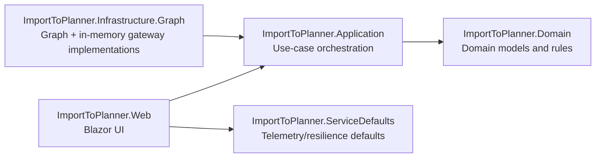

# Import To Planner

[](https://github.com/markheydon/import-to-planner/actions/workflows/ci.yml)


Import To Planner is a single-purpose Blazor application that imports tasks from CSV into Microsoft Planner through a safe, operator-led workflow.

The core flow is:
1. Select container and plan.
2. Upload CSV and validate.
3. Review dry-run preview.
4. Explicitly confirm execution.
5. Review created, reused/skipped, failed, and manual-action outcomes.

The app supports both in-memory mode (local development) and Microsoft Graph mode (live Planner operations), with behaviour parity where planner behaviour is affected.

## Technology Stack

- SDK and language:
  - .NET SDK 10.0.100 (see `global.json`)
  - C# 14 / ASP.NET Core Blazor
- UI and UX:
  - MudBlazor 8.6.0
- Core dependencies:
  - CsvHelper 33.1.0
  - Microsoft.Graph 5.105.0
  - Microsoft.Kiota.Abstractions 1.22.2
  - Microsoft.Identity.Web and Microsoft.Identity.Web.UI 4.9.0
- Observability and service defaults:
  - OpenTelemetry packages (1.15.x)
  - .NET Aspire service defaults
- Testing:
  - xUnit 2.9.3
  - bUnit 2.7.2
  - Microsoft.NET.Test.Sdk 18.5.1

## Project Architecture

This solution follows layered Clean Architecture boundaries.



Projects:

- `src/ImportToPlanner.Domain`: domain entities and business meaning.
- `src/ImportToPlanner.Application`: parser/orchestrator contracts and workflow logic.
- `src/ImportToPlanner.Infrastructure.Graph`: infrastructure implementations, including Graph and in-memory gateways.
- `src/ImportToPlanner.Web`: MudBlazor-based stepped import experience.
- `src/ImportToPlanner.ServiceDefaults`: shared service defaults for resilience and telemetry.

The repository also includes `apphost.cs` for Aspire AppHost orchestration and hosted-readiness planning.

## Getting Started

### Prerequisites

- .NET 10 SDK.
- Optional for Graph mode:
  - Microsoft 365 tenant access.
  - Entra app registration and local secret/config setup.
- Optional:
  - Aspire CLI for AppHost workflows.
  - Node.js (LTS) for local JavaScript syntax checks mirroring CI.

### Restore, Format, Build, and Test

```bash
dotnet restore ImportToPlanner.slnx
dotnet format ImportToPlanner.slnx --no-restore --verify-no-changes --verbosity minimal
dotnet build ImportToPlanner.slnx
dotnet test ImportToPlanner.slnx
```

### Run In-Memory Mode (default)

```bash
dotnet run --project src/ImportToPlanner.Web/ImportToPlanner.Web.csproj
```

Or explicitly:

```bash
PlannerGateway__UseGraph=false dotnet run --project src/ImportToPlanner.Web/ImportToPlanner.Web.csproj
```

Expected: no sign-in challenge, with in-memory container/plan data.

### Run Graph Mode

```bash
dotnet user-secrets set "PlannerGateway:UseGraph" "true" --project src/ImportToPlanner.Web
dotnet run --project src/ImportToPlanner.Web/ImportToPlanner.Web.csproj
```

Expected: unauthenticated sessions are redirected to sign in before the import UI becomes available.

For Graph setup details, see [docs-internal/microsoft-graph-guidelines.md](docs-internal/microsoft-graph-guidelines.md).

### Optional Aspire AppHost Workflow

```bash
aspire start --isolated
aspire describe
aspire logs web
aspire stop
```

CI also verifies AppHost parity:

```bash
dotnet restore apphost.cs
dotnet build apphost.cs --no-restore
```

## Project Structure

```text
src/
  ImportToPlanner.Application/
  ImportToPlanner.Domain/
  ImportToPlanner.Infrastructure.Graph/
  ImportToPlanner.ServiceDefaults/
  ImportToPlanner.Web/
tests/
  ImportToPlanner.Tests/
  ImportToPlanner.Web.Tests/
docs/
docs-internal/
specs/
apphost.cs
ImportToPlanner.slnx
```

## Key Features

- Guided five-step, vertically stacked MudBlazor workflow.
- Searchable container and plan selectors for large tenant datasets.
- CSV validation with row-level and file-level errors.
- Dry-run preview with planned bucket/task actions.
- Existing-task matching by task name with `already exists` outcomes.
- Stale-preview blocking via request and planner-state fingerprints.
- Confirm-and-execute gating with partial-success handling.
- Retry-once policy for transient Graph row failures.
- Execution report tabs for summary, manual actions, and errors.
- Runtime-mode behaviour parity across in-memory and Graph implementations.

## Development Workflow

- Branch from `main`; open focused PRs targeting `main`.
- Keep a linear history (rebase/squash; no merge commits).
- Keep CI green before requesting review.
- Maintain Clean Architecture boundaries and dependency direction.
- Preserve safety guarantees: dry-run non-destructive behaviour, stale-preview checks, and user-safe error outputs.
- Where planner behaviour is changed, verify both runtime modes (`PlannerGateway:UseGraph` true and false), unless explicitly scoped and documented.

Repository process and governance:

- [CONTRIBUTING.md](CONTRIBUTING.md)
- [AGENTS.md](AGENTS.md)
- [.specify/memory/constitution.md](.specify/memory/constitution.md)

## Coding Standards

- Use UK English for user-facing copy and contributor-facing documentation.
- Keep business rules in Domain/Application; keep UI concerns in Web; keep Graph details in Infrastructure.
- Prefer MudBlazor components and parameters before custom CSS.
- Use modern C# features supported by the pinned SDK; keep async flows non-blocking.
- Validate boundary inputs and avoid leaking secrets/tenant-sensitive details in user-facing outputs.

Primary standards references:

- [.github/copilot-instructions.md](.github/copilot-instructions.md)
- [.github/instructions/blazor-csharp.instructions.md](.github/instructions/blazor-csharp.instructions.md)
- [.github/instructions/csharp-clean-architecture.instructions.md](.github/instructions/csharp-clean-architecture.instructions.md)

## Testing

Test projects:

- `tests/ImportToPlanner.Tests`: unit and integration-style tests for application/infrastructure behaviour.
- `tests/ImportToPlanner.Web.Tests`: Blazor UI workflow and rendering tests.

Run all tests:

```bash
dotnet test ImportToPlanner.slnx
```

Optional coverage collection:

```bash
dotnet tool install -g dotnet-coverage
dotnet-coverage collect -f cobertura -o coverage.cobertura.xml dotnet test ImportToPlanner.slnx
```

Local JS syntax checks (mirrors CI job):

```bash
git ls-files '*.js' | xargs -n1 node --check
```

See [tests/README.md](tests/README.md) for testing guidance and constitutional expectations.

## Contributing

Contributions are welcome and reviewed for scope fit, safety, and maintainability.

- Read [CONTRIBUTING.md](CONTRIBUTING.md) before opening a PR.
- Follow [CODE_OF_CONDUCT.md](CODE_OF_CONDUCT.md).
- Keep changes focused and include tests for behaviour changes.
- Update relevant documentation in the same PR when setup or workflow changes.

## Further Reading

- [specs/001-import-planner-csv/spec.md](specs/001-import-planner-csv/spec.md)
- [specs/001-import-planner-csv/contracts/import-workflow-contract.md](specs/001-import-planner-csv/contracts/import-workflow-contract.md)
- [specs/001-import-planner-csv/quickstart.md](specs/001-import-planner-csv/quickstart.md)
- [specs/002-ui-ux-redesign/spec.md](specs/002-ui-ux-redesign/spec.md)
- [specs/002-ui-ux-redesign/plan.md](specs/002-ui-ux-redesign/plan.md)
- [specs/002-ui-ux-redesign/quickstart.md](specs/002-ui-ux-redesign/quickstart.md)
- [docs-internal/README.md](docs-internal/README.md)
- [docs-internal/aspire-production-readiness.md](docs-internal/aspire-production-readiness.md)
- [docs-internal/roadmap-and-limitations.md](docs-internal/roadmap-and-limitations.md)

## Licence

This project is licensed under the [MIT Licence](LICENSE).
