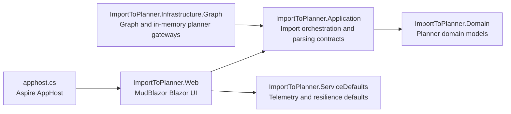

# Import To Planner

[](https://github.com/markheydon/import-to-planner/actions/workflows/ci.yml)


Import To Planner is a single-purpose Blazor application for importing CSV task lists into Microsoft Planner through a safe, operator-led workflow. It is designed to make bulk task creation easier without removing the checkpoints that matter: validation, dry-run preview, explicit confirmation, stale-preview protection, and execution reporting.

The current UI is a MudBlazor-based stepped experience:

1. Select a container.
2. Select a plan.
3. Upload a CSV file and choose import options.
4. Validate and preview the import plan.
5. Confirm execution and review results.

The application supports two runtime modes:

- In-memory mode for local development and fast verification without tenant credentials.
- Microsoft Graph mode for live Planner operations with sign-in enforcement.

## Technology Stack

- Platform and language:
  - .NET SDK 10.0.100
  - C# 14
  - ASP.NET Core Blazor Web App
- UI:
  - MudBlazor 9.4.0
- Core libraries:
  - CsvHelper 33.1.0
  - Microsoft.Graph 5.105.0
  - Microsoft.Kiota.Abstractions 1.22.2
  - Microsoft.Identity.Web 4.9.0
  - Microsoft.Identity.Web.UI 4.9.0
- Hosting and observability:
  - .NET Aspire AppHost SDK 13.3.0
  - OpenTelemetry 1.15.x packages
  - ImportToPlanner.ServiceDefaults for resilience and telemetry defaults
- Testing:
  - xUnit 2.9.3
  - bUnit 2.7.2
  - Microsoft.NET.Test.Sdk 18.5.1

Primary source files for these versions are [global.json](global.json), [Directory.Packages.props](Directory.Packages.props), [ImportToPlanner.slnx](ImportToPlanner.slnx), and [apphost.cs](apphost.cs).

## Project Architecture

The solution follows a layered Clean Architecture split. Business rules live in Domain and Application, infrastructure details stay behind abstractions, and the web project focuses on UI delivery.



Projects in the solution:

- `src/ImportToPlanner.Domain`: domain entities and planner-facing business meaning.
- `src/ImportToPlanner.Application`: import parsing abstractions, orchestration, models, and workflow rules.
- `src/ImportToPlanner.Infrastructure.Graph`: Graph-backed and in-memory planner gateway implementations.
- `src/ImportToPlanner.Web`: Blazor UI, authentication entry behaviour, and stepped import workflow.
- `src/ImportToPlanner.ServiceDefaults`: shared resilience, service discovery, and OpenTelemetry defaults.

Architectural boundaries and governance are defined in [.specify/memory/constitution.md](.specify/memory/constitution.md), [AGENTS.md](AGENTS.md), and [.github/copilot-instructions.md](.github/copilot-instructions.md).

## Getting Started

### Prerequisites

- .NET 10 SDK.
- Optional for Graph mode:
  - A Microsoft 365 account with access to Microsoft Planner.
  - An Entra ID app registration with the required delegated permissions.
  - Local secrets or configuration for `AzureAd` settings.
- Optional developer tooling:
  - Aspire CLI for AppHost workflows.
  - Node.js (LTS) for local JavaScript syntax checks that mirror CI.
  - GitHub CLI for issue and pull request workflows.

### Restore, format, build, and test

```bash
dotnet restore ImportToPlanner.slnx
dotnet format ImportToPlanner.slnx --no-restore --verify-no-changes --verbosity minimal
dotnet build ImportToPlanner.slnx
dotnet test ImportToPlanner.slnx
git ls-files '*.js' | xargs -n1 node --check
```

### Run in in-memory mode

The repository defaults to in-memory mode, so the app can be run locally without tenant credentials:

```bash
dotnet run --project src/ImportToPlanner.Web/ImportToPlanner.Web.csproj
```

Or explicitly:

```bash
PlannerGateway__UseGraph=false dotnet run --project src/ImportToPlanner.Web/ImportToPlanner.Web.csproj
```

Expected behaviour:

- No sign-in redirect.
- Pre-seeded container and plan data.
- Full stepped workflow available for local validation and UI testing.

### Run in Graph mode

Set the Graph switch and provide your local secrets or configuration first:

```bash
dotnet user-secrets set "PlannerGateway:UseGraph" "true" --project src/ImportToPlanner.Web
dotnet run --project src/ImportToPlanner.Web/ImportToPlanner.Web.csproj
```

Expected behaviour:

- Unauthenticated users are redirected to sign in before reaching the import workflow.
- Container and plan data are loaded from Microsoft Graph for the signed-in user context.

The default configuration shape is shown in [src/ImportToPlanner.Web/appsettings.json](src/ImportToPlanner.Web/appsettings.json). Graph-specific implementation guidance lives in [docs-internal/microsoft-graph-guidelines.md](docs-internal/microsoft-graph-guidelines.md).

### Run via Aspire AppHost

The repository includes a minimal AppHost that launches the web project:

```bash
aspire start --isolated
aspire describe
aspire logs web
aspire stop
```

For the current AppHost graph, no container runtime is required because only the web project is hosted.

## Project Structure

```text
src/
  ImportToPlanner.Application/
  ImportToPlanner.Domain/
  ImportToPlanner.Infrastructure.Graph/
  ImportToPlanner.ServiceDefaults/
  ImportToPlanner.Web/
tests/
  ImportToPlanner.Tests/
  ImportToPlanner.Web.Tests/
docs/
docs-internal/
specs/
apphost.cs
ImportToPlanner.slnx
```

Repository areas:

- `src/`: production projects.
- `tests/`: unit, integration-style, and Blazor UI tests.
- `docs/`: contributor-facing project documentation.
- `docs-internal/`: implementation notes and operational guidance.
- `specs/`: Spec Kit feature artefacts covering requirements, plans, tasks, quickstarts, and contracts.

## Key Features

- MudBlazor stepped import workflow with clear progression and locked/unlocked states.
- Searchable container and plan selectors for larger Microsoft 365 tenants.
- CSV validation with row-level and file-level feedback.
- Dry-run preview that separates validation and planning from execution.
- Explicit confirm-and-execute flow with stale-preview protection.
- Existing-task matching by task name only, reporting `already exists` instead of creating duplicates.
- Partial-success execution handling with retry-once behaviour for transient Graph row failures.
- Execution reporting with created items, reused/skipped items, manual actions, and errors.
- In-memory and Graph runtime modes with equivalent feature expectations where planner behaviour is affected.

The feature requirements and user-facing contracts are documented in [specs/001-import-planner-csv/spec.md](specs/001-import-planner-csv/spec.md), [specs/001-import-planner-csv/contracts/import-workflow-contract.md](specs/001-import-planner-csv/contracts/import-workflow-contract.md), and [specs/002-ui-ux-redesign/spec.md](specs/002-ui-ux-redesign/spec.md).

## Development Workflow

The repository uses feature specifications and repository governance to drive implementation:

- Feature requirements, plans, and task breakdowns live under `specs/`.
- Repository-wide policy is defined in [.github/copilot-instructions.md](.github/copilot-instructions.md).
- Agent and skill delegation rules are defined in [AGENTS.md](AGENTS.md).
- Constitutional quality gates are defined in [.specify/memory/constitution.md](.specify/memory/constitution.md).

Contribution workflow summary:

1. Branch from `main`.
2. Keep changes focused to one logical concern.
3. Preserve linear history by rebasing or squashing; merge commits are not permitted.
4. Keep CI green before requesting review.
5. Update tests and relevant documentation in the same change when behaviour or setup changes.

The current UI redesign work is tracked in [specs/002-ui-ux-redesign/plan.md](specs/002-ui-ux-redesign/plan.md) and [specs/002-ui-ux-redesign/tasks.md](specs/002-ui-ux-redesign/tasks.md).

## Coding Standards

Key repository standards:

- Use UK English in end-user and contributor-facing documentation and UI copy.
- Preserve Clean Architecture boundaries between Web, Application, Domain, and Infrastructure.
- Prefer MudBlazor components and parameters before custom CSS or hand-authored HTML workarounds.
- Keep Graph and Kiota implementation details inside Infrastructure.
- Use async end-to-end for I/O work and avoid blocking calls.
- Do not expose secrets, certificate values, or tenant-sensitive details in logs or user-facing messages.

Primary standards references:

- [.github/copilot-instructions.md](.github/copilot-instructions.md)
- [.github/instructions/blazor-csharp.instructions.md](.github/instructions/blazor-csharp.instructions.md)
- [.github/instructions/csharp-clean-architecture.instructions.md](.github/instructions/csharp-clean-architecture.instructions.md)
- [docs-internal/microsoft-graph-guidelines.md](docs-internal/microsoft-graph-guidelines.md)

## Testing

Test projects:

- `tests/ImportToPlanner.Tests`: application and infrastructure unit or integration-style coverage.
- `tests/ImportToPlanner.Web.Tests`: Blazor UI smoke and workflow coverage with bUnit.

Run all tests:

```bash
dotnet test ImportToPlanner.slnx
```

Collect coverage locally:

```bash
dotnet tool install -g dotnet-coverage
dotnet-coverage collect -f cobertura -o coverage.cobertura.xml dotnet test ImportToPlanner.slnx
```

Testing expectations include regression tests for behaviour changes and parity checks for both runtime modes when planner behaviour is affected. See [tests/README.md](tests/README.md) and [.specify/memory/constitution.md](.specify/memory/constitution.md).

## Contributing

Contributions are welcome, but the project is intentionally narrow in scope and reviewed for fit, safety, and maintainability.

- Read [CONTRIBUTING.md](CONTRIBUTING.md) before opening a pull request.
- Follow [CODE_OF_CONDUCT.md](CODE_OF_CONDUCT.md).
- Keep pull requests small and focused.
- Ensure all CI checks pass before requesting review.
- Reply to review comments in-thread when addressing pull request feedback.
- Update setup or workflow documentation when local development behaviour changes.

## Further Reading

- [specs/001-import-planner-csv/quickstart.md](specs/001-import-planner-csv/quickstart.md)
- [specs/002-ui-ux-redesign/quickstart.md](specs/002-ui-ux-redesign/quickstart.md)
- [docs-internal/README.md](docs-internal/README.md)
- [docs-internal/aspire-production-readiness.md](docs-internal/aspire-production-readiness.md)
- [docs-internal/roadmap-and-limitations.md](docs-internal/roadmap-and-limitations.md)

## Licence

This project is licensed under the [MIT Licence](LICENSE).
