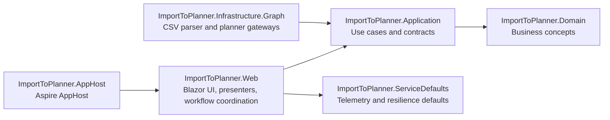

# Import To Planner

[](https://github.com/markheydon/import-to-planner/actions/workflows/ci.yml)


Import To Planner is a single-purpose Blazor application that imports CSV task lists into Microsoft Planner using a safe, operator-led flow.

The workflow preserves operational safeguards:

1. Select container.
2. Select plan.
3. Upload CSV and import options.
4. Validate and preview.
5. Confirm execution and review results.

The app now has one supported runtime path:

- Microsoft Graph planner operations with table-backed tenant metadata and blob-backed Data Protection persistence.
- Authentication remains authority-driven through `AzureAd:TenantId` (`organizations` or a specific tenant value).

## Key Features

- Row-level and file-level CSV validation before write actions.
- Dry-run preview separated from execution.
- Explicit confirm-and-execute flow with stale-preview protection.
- Existing-task matching by task name (`already exists` outcome).
- Partial-success execution handling with a single retry for transient row failures.
- Execution reporting for created items, skipped or reused items, manual actions, and errors.
- Searchable container and plan selectors for larger tenants.
- Regression coverage for startup validation, authority handling, and single-path planner registration.

Primary feature sources:

- [specs/001-import-planner-csv/spec.md](specs/001-import-planner-csv/spec.md)
- [specs/001-import-planner-csv/contracts/import-workflow-contract.md](specs/001-import-planner-csv/contracts/import-workflow-contract.md)
- [specs/002-ui-ux-redesign/spec.md](specs/002-ui-ux-redesign/spec.md)
- [specs/003-align-clean-architecture/spec.md](specs/003-align-clean-architecture/spec.md)

## Technology Stack

- Platform and language:
  - .NET SDK 10.0.100
  - C# 14
  - ASP.NET Core Blazor Web App
- UI:
  - MudBlazor 9.4.0
- Core libraries:
  - CsvHelper 33.1.0
  - Microsoft.Graph 6.1.0
  - Microsoft.Kiota.Abstractions 2.0.0
  - Microsoft.Identity.Web 4.9.0
  - Microsoft.Identity.Web.UI 4.9.0
- Hosting and observability:
  - Aspire AppHost SDK 9.5.0
  - OpenTelemetry 1.15.x packages
  - Shared service defaults for resilience and telemetry
- Testing:
  - xUnit 2.9.3
  - bUnit 2.7.2
  - Microsoft.NET.Test.Sdk 18.5.1

Primary version sources:

- [global.json](global.json)
- [Directory.Packages.props](Directory.Packages.props)
- [ImportToPlanner.slnx](ImportToPlanner.slnx)
- [ImportToPlanner.AppHost/ImportToPlanner.AppHost.csproj](ImportToPlanner.AppHost/ImportToPlanner.AppHost.csproj)

## Project Architecture

The solution follows layered Clean Architecture. Domain and Application own policy, Infrastructure provides adapters, and Web owns presentation and workflow state.



Projects in solution:

- `src/ImportToPlanner.Domain`: domain entities and business concepts.
- `src/ImportToPlanner.Application`: use-case orchestration and boundary contracts.
- `src/ImportToPlanner.Infrastructure.Graph`: CSV parsing and planner gateway implementations.
- `src/ImportToPlanner.Web`: Blazor UI, authentication entry behaviour, and stepped workflow.
- `src/ImportToPlanner.ServiceDefaults`: shared service defaults for resilience and telemetry.

Architecture and governance references:

- [.specify/memory/constitution.md](.specify/memory/constitution.md)
- [.github/copilot-instructions.md](.github/copilot-instructions.md)
- [AGENTS.md](AGENTS.md)
- [docs-internal/engineering-policies.md](docs-internal/engineering-policies.md)

## Getting Started

### Choose your path

- Run with `AzureAd:TenantId=organizations` when you need shared-organisations authority behaviour.
- Run with a specific tenant ID when you need single-tenant authority behaviour.
- Use Aspire for both paths so storage wiring remains consistent with production.

### Prerequisites

- .NET 10 SDK.
- Microsoft 365 account with Planner access.
- Entra ID app registration with required delegated permissions.
- Local configuration for `AzureAd` and Graph settings.
- Optional local tooling:
  - Aspire CLI for developer workflows and local orchestration.
  - Node.js (LTS) for local JavaScript syntax checks used in CI.
  - GitHub CLI for issue and pull request workflows.

### Restore, format, build, test

```bash
dotnet restore ImportToPlanner.slnx
dotnet format ImportToPlanner.slnx --no-restore --verify-no-changes --verbosity minimal
dotnet build ImportToPlanner.slnx
dotnet test ImportToPlanner.slnx
git ls-files '*.js' | xargs -n1 node --check
```

### First run in VS Code

The repository includes ready-made Aspire launch profiles in [.vscode/launch.json](.vscode/launch.json):

- `Aspire: Run (Single Tenant - In Memory)` - recommended first run for contributors and local evaluation.
- `Aspire: Run (Single Tenant + Graph)` - self-hosted single-tenant sign-in and real Planner calls.
- `Aspire: Run (Multi Tenant + Hosted Storage)` - hosted shared multi-tenant verification with local hosted-storage emulation.

The first profile is deliberately ordered first so a new VS Code user lands on the simplest path.
Profile names are historical labels; all supported paths now use Graph plus storage-backed services.

### Run locally without Aspire

Aspire is the recommended path because it wires `storage`, `blobs`, and `tables` automatically. If you need to run the Web project directly, provide equivalent connection settings and AzureAd secrets first:

```bash
dotnet user-secrets set "AzureAd:TenantId" "organizations" --project src/ImportToPlanner.Web
dotnet user-secrets set "AzureAd:ClientId" "<client-id>" --project src/ImportToPlanner.Web
dotnet run --project src/ImportToPlanner.Web/ImportToPlanner.Web.csproj
```

Expected behaviour:

- Unauthenticated users are challenged through Microsoft Identity.
- Planner data comes from Microsoft Graph.
- Storage-backed services use the configured connection settings.

### Run with a specific tenant authority

Use this path when you want sign-in constrained to one tenant:

```bash
dotnet user-secrets set "AzureAd:TenantId" "<tenant-id-or-domain>" --project src/ImportToPlanner.Web
dotnet run --project src/ImportToPlanner.Web/ImportToPlanner.Web.csproj
```

Expected behaviour:

- Unauthenticated sessions are redirected to sign-in.
- Container and plan data are loaded from Microsoft Graph.
- Sign-in remains single-tenant.

See [src/ImportToPlanner.Web/appsettings.json](src/ImportToPlanner.Web/appsettings.json) for the full configuration shape, including `AzureAd`, certificate, and Graph scope placeholders, and see [docs-internal/microsoft-graph-guidelines.md](docs-internal/microsoft-graph-guidelines.md) for implementation guidance.

### Use Aspire for development workflows

Aspire is the recommended developer path because the AppHost and launch profiles keep authority and storage wiring explicit and consistent.

```bash
aspire start --isolated
aspire describe
aspire logs web
aspire stop
```

Notes:

- The AppHost always starts `storage`, `blobs`, `tables`, and `web`.
- A container runtime is needed for local Azurite emulation.
- For deeper developer guidance, see [docs-internal/developer-quickstart.md](docs-internal/developer-quickstart.md).

## Project Structure

```text
src/
  ImportToPlanner.Application/
  ImportToPlanner.Domain/
  ImportToPlanner.Infrastructure.Graph/
  ImportToPlanner.ServiceDefaults/
  ImportToPlanner.Web/
tests/
  ImportToPlanner.Tests/
  ImportToPlanner.Web.Tests/
docs/
docs-internal/
specs/
ImportToPlanner.AppHost/
ImportToPlanner.slnx
```

Repository areas:

- `src/`: production projects.
- `tests/`: unit, integration-style, and Blazor UI tests.
- `docs/`: public-facing documentation.
- `docs-internal/`: internal engineering guidance.
- `specs/`: Spec Kit artefacts (specs, plans, tasks, quickstarts, contracts).

## Development Workflow

This repository uses specification-led delivery and explicit governance:

- Feature requirements, plans, and tasks live in `specs/`.
- Repository-wide policy is in [.github/copilot-instructions.md](.github/copilot-instructions.md).
- Agent and skill delegation rules are in [AGENTS.md](AGENTS.md).
- Architecture governance is in [.specify/memory/constitution.md](.specify/memory/constitution.md).
- Operational policies are in [docs-internal/engineering-policies.md](docs-internal/engineering-policies.md).

Contribution flow summary:

1. Branch from `main`.
2. Keep the change focused to one logical concern.
3. Preserve linear history (rebase or squash; no merge commits).
4. Keep CI green before requesting review.
5. Update tests and relevant docs with behaviour or setup changes.

See [CONTRIBUTING.md](CONTRIBUTING.md) for full pull request and review-thread guidance.

## Coding Standards

Key standards:

- Use UK English in user-facing and contributor-facing wording.
- Preserve dependency direction and layer boundaries across Web, Application, Domain, and Infrastructure.
- Keep provider-specific concepts (Graph, Kiota, transport details) in adapter layers.
- Prefer MudBlazor components and parameters before custom CSS or HTML workarounds.
- Use async end-to-end for I/O and avoid blocking calls.
- Avoid exposing secrets, certificate values, or tenant-sensitive identifiers.

Standards references:

- [.github/copilot-instructions.md](.github/copilot-instructions.md)
- [.github/instructions/blazor-csharp.instructions.md](.github/instructions/blazor-csharp.instructions.md)
- [.github/instructions/csharp-clean-architecture.instructions.md](.github/instructions/csharp-clean-architecture.instructions.md)
- [docs-internal/microsoft-graph-guidelines.md](docs-internal/microsoft-graph-guidelines.md)

## Testing

Test projects:

- `tests/ImportToPlanner.Tests`: application and infrastructure tests.
- `tests/ImportToPlanner.Web.Tests`: Blazor UI and workflow tests.

Run all tests:

```bash
dotnet test ImportToPlanner.slnx
```

Collect coverage locally:

```bash
dotnet tool install -g dotnet-coverage
dotnet-coverage collect -f cobertura -o coverage.cobertura.xml dotnet test ImportToPlanner.slnx
```

Testing expectations include regression coverage for changed behaviour, startup validation, and authority-specific auth handling. See [tests/README.md](tests/README.md) and [.specify/memory/constitution.md](.specify/memory/constitution.md).

## Contributing

Contributions are welcome, but scope remains intentionally focused.

- Read [CONTRIBUTING.md](CONTRIBUTING.md) before opening a pull request.
- Follow [CODE_OF_CONDUCT.md](CODE_OF_CONDUCT.md).
- Keep pull requests small and focused.
- Ensure CI checks pass before requesting review.
- Reply to review comments in-thread.
- Update contributor setup docs when development behaviour changes.

## Further Reading

- [specs/004-add-multitenant-hosting/quickstart.md](specs/004-add-multitenant-hosting/quickstart.md)
- [docs-internal/microsoft-graph-guidelines.md](docs-internal/microsoft-graph-guidelines.md)
- [docs-internal/aspire-production-readiness.md](docs-internal/aspire-production-readiness.md)
- [tests/README.md](tests/README.md)
- [docs/README.md](docs/README.md)
- [docs-internal/README.md](docs-internal/README.md)
- [docs-internal/roadmap-and-limitations.md](docs-internal/roadmap-and-limitations.md)
- [specs/001-import-planner-csv/quickstart.md](specs/001-import-planner-csv/quickstart.md)
- [specs/002-ui-ux-redesign/quickstart.md](specs/002-ui-ux-redesign/quickstart.md)
- [specs/003-align-clean-architecture/quickstart.md](specs/003-align-clean-architecture/quickstart.md)

## Licence

This project is licensed under the [MIT Licence](LICENSE).
